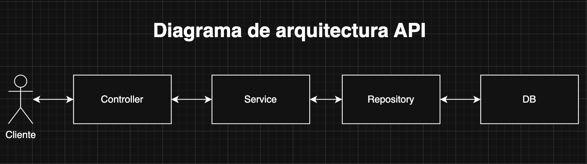
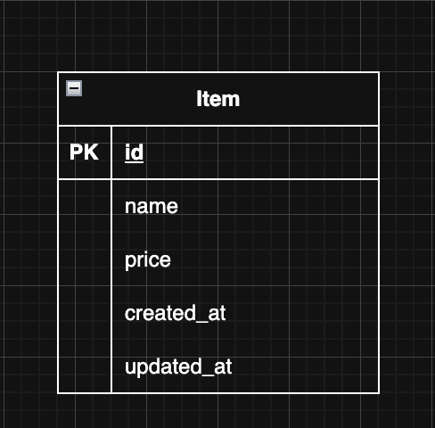
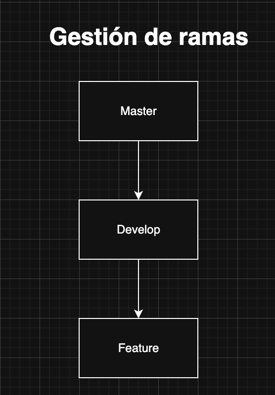

# Documentación de la API

## 📖 Tabla de Contenidos

1. [Introducción](#introducción)  
2. [Tecnologías](#tecnologías)  
3. [Arquitectura](#arquitectura)  
4. [Base de Datos](#base-de-datos)  
5. [Ramas de Git](#ramas-de-git)  
6. [Documentación de la API](#api-documentation)  
   - [Colección de Postman](#📖-postman-collection)  
   - [Cómo Importar la Colección en Postman](#📌-cómo-importar-la-colección-en-postman)  
7. [Instrucciones para Iniciar la API con Docker](#instrucciones-para-iniciar-la-api-con-docker)  
   - [Requisitos previos](#requisitos-previos)  
   - [Pasos para Iniciar la API](#pasos-para-iniciar-la-api)  
   - [Clonar el repositorio](#1-clonar-el-repositorio)  
   - [Configurar el archivo de entorno `.env`](#2-configurar-el-archivo-de-entorno-env)  
   - [Iniciar Docker](#3-iniciar-docker)  
   - [Apagar los contenedores](#4-apagar-los-contenedores)  
   - [Acceder a la API](#5-acceder-a-la-api)  

## Introducción

Esta API está diseñada como una API RESTful para la gestión de **Items** en el sistema. Esta API proporciona un conjunto de endpoints para realizar operaciones **CRUD** (Crear, Leer, Actualizar y Eliminar) sobre los recursos **Item**.


## Tecnologías

- **Backend**: Node.js + Express
- **Base de Datos**: MySQL + TypeORM
- **Validación de Datos**: Joi
- **Documentación**: Swagger-jsdoc
- **Pruebas**: Jest, Supertest
- **Manejo de Variables de Entorno**: Dotenv

## Arquitectura

La API sigue una arquitectura basada en **Controller - Service - Repository**, separando responsabilidades para mejorar la mantenibilidad del código:

- **Controller:** Maneja las solicitudes HTTP y la validación de datos de entrada.
- **Service:** Contiene la lógica de negocio y procesamiento de datos.
- **Repository:** Se encarga de la comunicación con la base de datos mediante **TypeORM**.


---

## Base de Datos

- Se utiliza **MySQL** como base de datos relacional.
- Se gestiona mediante **TypeORM** para manejar las entidades y operaciones sobre la base de datos.


---

## Ramas de Git

El proyecto sigue un flujo de trabajo basado en **Git Flow** con las siguientes ramas:

- **`master`** → Contiene la versión estable y en producción de la API.
- **`develop`** → Es la rama principal de desarrollo donde se integran nuevas funcionalidades antes de pasar a producción.
- **`feature/{nombre}`** → Ramas individuales para el desarrollo de nuevas características, que luego se fusionan en `develop`.

---

# API Documentation

## 📖 Postman Collection

Para probar los endpoints de esta API en **Postman**, puedes importar la siguiente colección:

📥 [Descargar colección de Postman](./doc/postman/eldoradoio.postman_collection.json)

### 📌 ¿Cómo Importar la Colección en Postman?
1. Abre **Postman**.
2. Ve a `File` > `Import`.
3. Selecciona `Upload Files` y carga el archivo `eldoradoio.postman_collection.json.json`.
4. ¡Listo! Ahora puedes usar los endpoints en Postman.

---

# Instrucciones para Iniciar la API con Docker

## Requisitos previos

- Tener **Docker** instalado en tu máquina. Si no lo tienes, puedes descargarlo e instalarlo desde [aquí](https://www.docker.com/get-started).

## Pasos para Iniciar la API

## 1. **Clonar el repositorio**:

   Clona el repositorio en tu máquina local:

   ```bash
   git clone https://github.com/tu-repositorio/coding-interview-backend-level-3.git
   ```

## 2. **Configurar el archivo de entorno `.env`**:

Copia el archivo de ejemplo y edita los valores necesarios:

```bash
cp .env.example .env
```

## 3. **Iniciar docker**

Descargar las imagenes

```bash
	docker-compose pull
```

Construir las imágenes de Docker y levantar los contenedores

```bash
	docker-compose up --build
```
Apagar los contenedores

```bash
	docker-compose down
```

## 5. Acceder a la API

Una vez que la API esté corriendo, puedes acceder a los endpoints en:

🔗 **Base URL:** [`http://localhost:3000/api`](http://localhost:3000/api)

📄 **Documentación Swagger:** [`http://localhost:3000/docs`](http://localhost:3000/docs)
